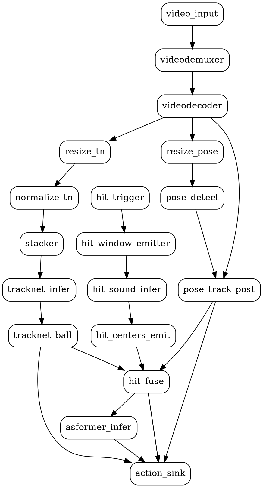

# Tennis Action Pipeline (Hit + Pose + TrackNet + ASFormer) — Design Spec

**Date:** 2026-05-13
**Target:** GPU pose server (CUDA / TensorRT) — Apple Silicon variant is out of scope for v1.
**Status:** Approved through brainstorming; awaiting plan.

**Development order:** All new flowunits ship as Python first for easier debugging. C++ ports follow as a v2 optimization, only for hotspots identified by profiling. Existing C++ flowunits (`tracknet_post`, `yolo_pose_post`) are left untouched — we add Python siblings rather than retrofitting them.

## 1. Goal

Build a single ModelBox graph that ingests a video file and produces:

1. A JSON list of confirmed tennis hits with action class per hit.
2. A rendered overlay mp4 with skeleton + ball + per-hit action labels burned in.
3. A JSON list of audio hits that didn't survive fusion, with drop reasons (for debugging tuning of thresholds).

For each hit the pipeline must answer: *when* did it happen (frame), *who* hit it (player track_id), *what* action it was (ASFormer class), and *how confident* the fusion is.

The pipeline runs offline on a video file. It is not triggered over HTTP.

## 2. Inputs and outputs

**Input** — one mp4 file with audio + video (default: `src/demo/tennis_action/test/tennis_test.mp4`, 1280×720 / 30 fps / 4.7 s / H.264 + AAC).

**Outputs**

- `tennis_actions.json` — list of confirmed hits, each:
  ```
  {hit_id, frame_idx, t_sec, track_id,
   action, action_conf,
   audio_conf, fused_conf, ball_xy,
   tie_resolved, boundary_padded}
  ```
  Plus a `summary` block: `{audio_hits, confirmed, dropped: {reason: count}}`.
- `tennis_actions_overlay.mp4` — same frame count and duration as the source, with skeleton (per track), ball circle, and an action label that persists for ~30 frames after each hit.
- `tennis_actions_dropped.json` — audio hits that didn't survive fusion, with reason codes.

Default output paths: `/tmp/tennis_actions.json`, `/tmp/tennis_actions_overlay.mp4`, `/tmp/tennis_actions_dropped.json` — overridable in `action_sink` config.

## 3. Architecture

Single ModelBox graph, three branches fan out from the GPU video decoder, fusion at the end:

```
video_input ──► video_demuxer ──► video_decoder (cuda, nvcodec) ──┬──► resize_640 (cuda) ──► yolo_pose_detect (cuda, tensorrt)
                                                                  │                       │
                                                                  │                       └─► yolo_pose_track_post (cpu, Python)
                                                                  │                            • NMS + greedy-IoU SORT in numpy
                                                                  │                            • emits tracked_poses stream
                                                                  │
                                                                  ├─► resize_512x288 (cuda) ─► normalize (cuda) ─►
                                                                  │                       tracknet_frame_stacker (cpu, existing) ─►
                                                                  │                       tracknet_deep (cuda, tensorrt) ─►
                                                                  │                       tracknet_ball_emitter (cpu, Python, new)
                                                                  │                            • centroid from heatmap in numpy
                                                                  │                            • emits ball_pos stream
                                                                  │
                                                                  └─ [implicit: hit_window_emitter reads audio from video_path]

hit_trigger ──► hit_window_emitter (cpu, expand) ──►
                hit_sound_infer_ort (cpu) ──►
                hit_centers_emitter (cpu, collapse) ──► hit_centers buffer (1 per session)

hit_centers + ball_pos + tracked_poses ──► hit_fuse (cpu, collapse → expand)
                                              • cross-confirm hits using ball trajectory
                                              • assign hitter (closest wrist to ball at f)
                                              • assemble T-frame keypoint window per track
                                              • emits (hit_window, hit_meta) per confirmed hit
                                              │
                                              ├──► asformer_infer_ort (cpu) ──► logits ─┐
                                              │                                          ▼
                                              └────────────────────────────► action_sink (cpu)
                                                                              + ball_pos stream
                                                                              + tracked_poses stream
                                                                              ─► JSON + overlay mp4
```

Streams have very different cardinalities: audio collapses to a single buffer covering the whole video; ball_pos and tracked_poses stream per-frame; hit_fuse buffers all three to session end then expands K confirmed hits.

## 4. New / extended flowunits

### 4.1 `yolo_pose_track_post` (new, Python, device=cpu)

The existing C++ `yolo_pose_post` and `yolo_track_post` flowunits only emit drawn images. We add a new Python flowunit that re-implements the post-processing in numpy and emits a structured port. `yolo_pose_post` and `yolo_track_post` stay untouched. C++ port deferred to v2 if profiling shows this is the bottleneck.

| Field | Value |
|---|---|
| Inputs | `in_image` (uint8 BGR HxWx3, for the optional overlay), `in_feat` (float `[B, 5+17*3, N]`, raw YOLOv8-pose tensor) |
| Outputs | `tracked_poses` (JSON: `[{track_id, bbox:[x1,y1,x2,y2], score, kpts:[[x,y,c]×17]}]`, source-frame coords); `out_data` (uint8 BGR overlay, optional, default off — drawing via cv2) |
| Config | `conf_threshold=0.25`, `iou_threshold=0.45`, `kpt_threshold=0.5`, `track_iou=0.3`, `max_lost=20`, `emit_overlay=false`, `net_h=640`, `net_w=640` |
| State | Per-session tracker held on `self`: list of `Track {id, label, score, x1..y2, hits, lost}` updated each `Process()` call |

Implementation references for the algorithm details (since we are re-doing the same logic in Python):
- NMS and decode: mirror `src/drivers/devices/cpu/flowunit/yolo_pose_post/yolo_pose_post_flowunit.cc` `Decode()` and `Nms()`.
- SORT step: mirror `src/drivers/devices/cpu/flowunit/yolo_track_post/yolo_track_post_flowunit.cc` `UpdateTracks()`.

### 4.2 `tracknet_ball_emitter` (new, Python, device=cpu)

The v1 graph wants `ball_pos` as a structured port; the existing C++ `tracknet_post` only draws (and overlay drawing now happens in `action_sink` anyway). New Python flowunit consumes the same heatmap port and emits `ball_pos`. The existing `tracknet_post` is **not** modified — it remains the right tool for the standalone `apple_silicon_tracknet` overlay demo. C++ port deferred to v2.

| Field | Value |
|---|---|
| Inputs | `heatmaps` (float CHW `3×288×512` per frame, same as the existing `tracknet_post:heatmaps`) |
| Outputs | `ball_pos` — `float[4]` = `[cx, cy, peak, frame_idx]` in source-frame coords. `peak < score_thr` ⇒ `cx=cy=-1` sentinel. |
| Config | `score_thr=0.3`, `mask_ratio=0.5`, `net_h=288`, `net_w=512`, `source_width=1280`, `source_height=720` (for coord scaling — same values as `hit_fuse.image_*`) |
| Algorithm | Mirror `extern "C" bool TrackNetExtractCentroid()` from `tracknet_post_flowunit.cc`: argmax on per-channel heatmap → threshold check → masked-centroid in a `mask_ratio × min(net_h, net_w)` window around peak → scale `(cx, cy)` from net resolution to source resolution. |

### 4.3 `hit_centers_emitter` (new, Python, device=cpu, collapse=true)

| Field | Value |
|---|---|
| Inputs | `logits` (float[1,2] per audio window) |
| Outputs | `hit_centers` — one collapsed JSON buffer at session end: `[{frame_idx, audio_conf}]` |
| Behavior | Reuses smoothing + duration filtering from `hit_intervals_sink` (constants: `smooth_win=5`, `max_hit_dur=1.0`). Converts audio-time hit centers to video frame indices using `video_fps`. |
| Config | `video_fps=30.0`, `step_sec=0.02`, `window_sec=0.5`, smoothing knobs |
| FPS source | Prefer `fps` field from upstream buffer Meta (set by `hit_window_emitter` via ffprobe); fall back to `video_fps` config. |

### 4.4 `hit_fuse` (new, Python, device=cpu, collapse on all inputs → expand on output)

The pipeline's brain. Owns cross-confirm + hitter assignment + T-frame keypoint window assembly + interpolation in one node because all three operations share the same in-memory state.

| Field | Value |
|---|---|
| Inputs | `hit_centers` (1 buffer), `ball_pos` (stream), `tracked_poses` (stream) |
| Outputs | `hit_window` (float32 `[T, 17, 3]`, normalized coords), `hit_meta` (JSON) — paired per confirmed hit; plus `dropped_hits` (1 collapsed JSON buffer at session end: `[{audio_hit_frame_idx, audio_conf, reason}]`) |
| Config | `T=32`, `require_visual_confirm=true`, `min_window_coverage=0.75`, `image_width=1280`, `image_height=720`, `asformer_meta_path` (points at `asformer_meta.json` for open-time T/num_kpts validation) |
| Normalization | For each kpt `(x, y, c)`: emit `(x / image_width, y / image_height, c)`. Confidence is untouched. The same convention must be used at ASFormer training time — recorded in `asformer_meta.input_layout` documentation. |

**Per-session algorithm (at session end):**

1. Build `frame_idx → ball_pos` and `frame_idx → poses` maps.
2. For each audio hit `(f, audio_conf)`:
   - **Cross-confirm**. Compute `v_pre = pos[f] − pos[f−3]`, `v_post = pos[f+3] − pos[f]`. Confirmed if `dot(v_pre, v_post) < 0` (direction flip) OR `‖v_post‖ < 0.3·‖v_pre‖` (sharp deceleration). If `ball_pos` missing in `[f−3, f+3]` and `require_visual_confirm=true` → drop with `reason=no_ball_near_hit`. If `require_visual_confirm=false`, skip cross-confirm and accept with `visual_agrees=false` recorded.
   - **Hitter assignment**. Distance from `ball_pos[f]` (or nearest available frame within ±2) to each track's `min(left_wrist, right_wrist)` keypoint at frame `f`. Pick the smallest. Tie within 5 px → break by bbox-IoU with a 30-px box centered at ball; still tied → lower `track_id`. If no track in `[f−2, f+2]` → drop with `reason=no_player_at_hit`.
   - **Window assembly**. Collect this track's kpts at frames `f − T/2 ... f + T/2 − 1`. Missing frames: linear-interpolate between neighbors if coverage ≥ `min_window_coverage`; pad leading/trailing from last-known (sets `boundary_padded=true`) when the hit is near video boundaries. Coverage < threshold → drop with `reason=window_coverage_low`.
   - **Track-id swap detection**: if bbox-IoU between consecutive frames of the chosen track drops below 0.2, attempt to stitch via best-IoU successor track for up to 2 frames; otherwise drop with `reason=track_lost`.
3. Emit one `(hit_window, hit_meta)` pair per confirmed hit. `hit_meta` includes: `hit_id, frame_idx, track_id, audio_conf, fused_conf, ball_xy, tie_resolved, boundary_padded, visual_agrees`.
4. Emit one collapsed `dropped_hits` buffer at session end with the side list — consumed by `action_sink` to produce `tennis_actions_dropped.json`.

**Open-time validation:** reads `asformer_meta.json` to confirm `meta.T == T` and `meta.num_kpts == 17`; mismatch fails open with explicit message.

### 4.5 `asformer_infer_ort` (new, TOML, device=cpu, virtual_type=onnxruntime)

Virtual-inference flowunit, descriptor-only:

```toml
[base]
name = "asformer_infer_ort"
device = "cpu"
type = "inference"
virtual_type = "onnxruntime"
entry = "./asformer.onnx"
```

I/O port names match the model's signature read from `asformer_meta.json`. Logical contract: input `hit_window` `[T, 17, 3]` (or `[T, 51]`); output `logits` `[num_classes]`. Pinning ORT to CPU is fine here — model is tiny relative to the CUDA YOLO + TrackNet path.

### 4.6 `action_sink` (new, Python, device=cpu, sink, collapse on streams)

Single sink doing both deliverables. Buffers structured per-frame streams during the session, then writes both files at session end.

| Field | Value |
|---|---|
| Inputs | `logits` (per hit), `hit_meta` (per hit), `dropped_hits` (1 collapsed), `tracked_poses` (stream), `ball_pos` (stream) |
| Outputs | None (sink). Writes `tennis_actions.json` + `tennis_actions_overlay.mp4` + `tennis_actions_dropped.json` |
| Config | `output_json`, `output_overlay`, `output_dropped`, `class_names_path` (points at `asformer_meta.json`), `overlay_encoder=h264_nvenc`, `overlay_fallback_encoder=libx264`, `hit_label_persist_frames=30` |
| Overlay rendering | Reopens the original video file (path passed via buffer meta from `video_input` or via config), iterates with cv2, draws skeleton + ball + action labels, writes via ffmpeg. Same pattern as `hit_postprocess` in `hit_sound_coreml`. |

## 5. Graph TOML

`src/demo/tennis_action/graph/tennis_action_cuda.toml.in`:



**Wiring notes:**

- `videodecoder:out_video_frame` fans out four ways (3 cpu consumers + 1 cuda resize). Engine inserts D2H copies as needed. If profiling shows this is hot, add an explicit cpu mirror node post-v1.
- `video_input.source_url` and `hit_window_emitter.video_path` reference the same file. Single CMake template variable `@DEMO_TENNIS_ACTION_VIDEO@` keeps them in sync.
- `tracknet_ball:ball_pos` and `pose_track_post:tracked_poses` each fan out to two consumers (`hit_fuse` and `action_sink`). Both consumers are cpu — no extra copies.

## 6. Model artifact preconditions

Under `assets/tennis_action/` (relative paths in TOMLs are resolved against the flowunit install dir):

- `yolov8n-pose.onnx` — user exports from Ultralytics. Input layout `1×3×640×640`, output `1×56×8400` (4 bbox + 1 score + 51 kpts × N anchors).
- `tracknet_deep.onnx` — user converts from the existing `tracknet_deep.mlpackage` via a one-shot export script (the script lives at `scripts/export_tracknet_onnx.py`). Input `1×9×288×512` (3 stacked 3-channel frames), output `1×3×288×512` heatmap.
- `asformer.onnx` + `asformer_meta.json` — user supplies. Meta: `{classes: [...], num_kpts: 17, T: 32, input_layout: "TKC" | "KCT"}`.
- `hit_sound/best.onnx` — already in tree.

CMake adds a configure-time check that **warns** if any of these are missing, but does not fail the build (code-only iteration must still work).

## 7. Error handling

### Per-hit drops (recorded in `tennis_actions_dropped.json`)

| Reason | Trigger |
|---|---|
| `no_ball_near_hit` | All frames in `[f−3, f+3]` have `ball_pos.peak < score_thr` AND `require_visual_confirm=true` |
| `trajectory_not_consistent` | `dot(v_pre, v_post) ≥ 0` AND `‖v_post‖ ≥ 0.3·‖v_pre‖` |
| `no_player_at_hit` | No track present in `[f−2, f+2]` |
| `window_coverage_low` | < `min_window_coverage` of T frames have valid kpts for chosen track after interpolation |
| `track_lost` | bbox-IoU between consecutive frames of chosen track < 0.2 and no stitch within 2 frames |

### Graph-open-time failures (fail fast)

- Video has no audio stream → `hit_window_emitter.Open()` errors with explicit message.
- Required ONNX file missing → virtual-inference flowunit `Open()` errors.
- `asformer_meta.T != hit_fuse.T` or `num_kpts != 17` → `hit_fuse.Open()` errors.

### Soft failures (graph continues, sink reports)

- Hitter tie within 5 px → bbox-IoU tie-break; `tie_resolved=true` in `hit_meta`.
- Hitter track missing in some window frames → interpolated; `boundary_padded=true` if leading/trailing extrapolation was used.
- Two hits within T frames → both kept, windows overlap; each scored independently.
- `video_fps` mismatch → use upstream Meta's fps; config is fallback.

### Sink-time failures (logged, no crash)

- JSON write fails → log, overlay still attempts.
- Overlay write fails → log, JSON still written. Encoder falls back from `h264_nvenc` to `libx264` if nvenc unavailable.
- No confirmed hits → both files write empty arrays + populated `summary` block.

### Implementation-time risks (deferred to fix-agents)

Not designed around in this spec. If they surface during bring-up on the pose server, address with focused fix-agent sessions:

- TensorRT version compatibility (ONNX opset, layer support) for `yolo_pose_detect` and `tracknet_deep`.
- NVENC availability — overlay falls back to libx264 (configurable).
- ORT CPU thread thrashing — set `intra_op_num_threads=2` if it competes with CUDA.
- D2H fan-out cost from `videodecoder` — add cpu mirror node if hot.

## 8. Testing

### Python offline tests (stub `_flowunit` module pattern from `hit_sound_detect/offline_smoke_test.py`)

All v1 unit tests are Python. C++ gtest is added only when (and if) a C++ port lands in v2.

`yolo_pose_track_post/offline_smoke_test.py`:
- 2-person synthetic `[1, 56, 8400]` feature tensor → NMS yields 2 tracks with stable IDs across 5 successive `Process()` calls.
- After `max_lost` empty frames, IDs are recycled (no leak).
- `tracked_poses` JSON port: field types and array lengths.
- Coord mapping: `net_h=net_w=640` input → arbitrary source-frame size returns kpts in source coords (parameterized H×W).
- `emit_overlay=false` → no `out_data` buffer emitted.

`tracknet_ball_emitter/offline_smoke_test.py`:
- Heatmap with a single peak above `score_thr` → port emits `[cx, cy, peak, frame_idx]` correctly scaled to `source_width × source_height`.
- All-zero heatmap (peak below threshold) → `cx=cy=-1` sentinel.
- Multi-channel heatmap (3 channels per existing model): asserts the channel selection matches the reference C++ implementation.

`hit_centers_emitter/offline_smoke_test.py`:
- Synthetic 250-window logit stream with 2 hit clusters → collapsed buffer has 2 entries at expected frame_idx.
- `video_fps` swap (25→30) shifts frame_idx mapping correctly.

`hit_fuse/offline_smoke_test.py` (highest-risk flowunit, most exhaustive):
- Clean direction-flip at hit frame → confirmed.
- No flip → dropped (`trajectory_not_consistent`).
- 2 tracks, ball at one wrist → correct track selected. Symmetric case → tie-break path exercised.
- Track present in 30/32 frames → interpolation fills 2 gaps. Present in 20/32 → drops (`window_coverage_low`).
- Fabricated track-id swap mid-window → stitching succeeds; harder swap drops (`track_lost`).
- Hit at frame 5, T=32 → leading 11 frames padded, `boundary_padded=true`.
- Direct Python-class invocation with 3 in-memory streams → emitted `(hit_window, hit_meta)` pairs match expected.

`action_sink/offline_smoke_test.py`:
- Synthetic per-hit logits + per-frame streams → JSON schema matches; overlay mp4 exists; ffprobe reports duration within ±100 ms of source and frame count ≥ source.
- Empty hits → both files written with `summary` populated.
- Overlay write to non-writable path → exit 0, JSON still written.

### Graph-level smoke test

`src/demo/tennis_action/graph/test_tennis_action.py`:
- Runs `modelbox-tool flow run -name TennisAction -path .../tennis_action_cuda.toml` against `tennis_test.mp4` (committed to `src/demo/tennis_action/test/`).
- Asserts: `tennis_actions.json` exists, ≥1 confirmed hit; each hit has `track_id`, `action ∈ classes`, `frame_idx ∈ [0, 141]`.
- Asserts: `tennis_actions_overlay.mp4` decodable; duration ±100 ms of source; frame count ≥ source frame count.
- Asserts: `tennis_actions_dropped.json` exists.
- **Visual check**: ffprobe-extracts one frame near each reported hit; file size > 5 KB lower bound (sanity that overlays drew, not black frames).
- `--no-audio` variant on `tennis_test_noaudio.mp4` (generated at test time via `ffmpeg -an`) → graph open fails with the expected message.
- `--no-cuda` variant swaps `device=cuda` → `device=cpu` for inference TOMLs, points at stub ONNX models built by `scripts/build_tennis_action_stub_onnx.py` (kept under 1 MB combined, generated not committed) → topology runs end-to-end on CI without a GPU.

### CI integration

- Mirror `test_apple_silicon_car_detection`'s `CMakeLists.txt` `add_test(...)` pattern.
- Python smoke tests skip cleanly when ONNX assets are absent (printed reason, not failure).
- `--no-cuda` graph test is the CI gate. Full CUDA graph is exercised manually on the pose server during bring-up.
- When C++ ports land in v2, gtest tests will be added alongside, run unconditionally.

### What's intentionally not tested

- CUDA execution path (no GPU in CI) — covered by manual bring-up.
- TensorRT engine build / version compatibility — same.
- NVENC overlay output — tests use libx264 fallback.
- End-to-end action-classification accuracy — we don't have ground-truth labels; ASFormer output is smoke-checked for "model ran, produced valid logits, sink wrote a class in the configured list".

## 9. Source tree

```
src/demo/tennis_action/
├── CMakeLists.txt
├── flowunit/
│   ├── CMakeLists.txt
│   ├── yolo_pose_track_post/
│   │   ├── CMakeLists.txt
│   │   ├── yolo_pose_track_post.py
│   │   ├── yolo_pose_track_post.toml
│   │   └── offline_smoke_test.py
│   ├── tracknet_ball_emitter/
│   │   ├── CMakeLists.txt
│   │   ├── tracknet_ball_emitter.py
│   │   ├── tracknet_ball_emitter.toml
│   │   └── offline_smoke_test.py
│   ├── hit_centers_emitter/
│   │   ├── CMakeLists.txt
│   │   ├── hit_centers_emitter.py
│   │   ├── hit_centers_emitter.toml
│   │   └── offline_smoke_test.py
│   ├── hit_fuse/
│   │   ├── CMakeLists.txt
│   │   ├── hit_fuse.py
│   │   ├── hit_fuse.toml
│   │   └── offline_smoke_test.py
│   ├── asformer_infer_ort/
│   │   ├── CMakeLists.txt
│   │   └── asformer_infer_ort.toml
│   └── action_sink/
│       ├── CMakeLists.txt
│       ├── action_sink.py
│       ├── action_sink.toml
│       └── offline_smoke_test.py
├── graph/
│   ├── CMakeLists.txt
│   ├── tennis_action_cuda.toml.in
│   └── test_tennis_action.py
├── scripts/
│   ├── export_tracknet_onnx.py
│   └── build_tennis_action_stub_onnx.py
└── test/
    └── tennis_test.mp4               (committed, 542 KB)
```

No existing C++ flowunits are modified. `tracknet_post` and `yolo_pose_post` are left as-is; their callers (the apple_silicon overlay demos) keep working unchanged.

Assets (gitignored by default, dropped in by user or by the export scripts):
- `assets/tennis_action/yolov8n-pose.onnx`
- `assets/tennis_action/tracknet_deep.onnx`
- `assets/tennis_action/asformer.onnx`
- `assets/tennis_action/asformer_meta.json`
- `assets/hit_sound/best.onnx` (already in tree)

## 10. Out of scope (v1)

- Apple Silicon variant of this graph.
- HTTP-triggered serving mode.
- A `trajectory_only` confirmation mode (no audio).
- Multi-stream concurrent processing (graph processes one video at a time).
- Action-class accuracy evaluation against ground-truth labels.
- Live camera input.

## 11. Implementation-plan handoff

Next step: invoke `superpowers:writing-plans` against this spec. Expected plan units in roughly this order (Python-first, ONNX export scripts early so we can stub-test against real model shapes):

1. ONNX export scripts (`export_tracknet_onnx.py`, `build_tennis_action_stub_onnx.py`). Generates artifacts needed by later test fixtures.
2. Python flowunit scaffolds — directory layout, `.toml` descriptors, skeleton `.py` files that just pass-through. Lets `modelbox-tool flow run` discover them and lets the graph open before any logic is written.
3. `tracknet_ball_emitter` logic + offline test (simplest of the new flowunits, validates the numpy-on-heatmap pattern).
4. `yolo_pose_track_post` logic + offline test (NMS + SORT in numpy — moderate complexity, but the algorithm exists in C++ to mirror).
5. `hit_centers_emitter` logic + offline test (reuses smoothing constants from `hit_intervals_sink`).
6. `hit_fuse` logic + offline test (hardest unit — budget the most time for it, exhaustive test cases per §8).
7. `asformer_infer_ort` virtual inference TOML.
8. `action_sink` logic + overlay rendering + offline test.
9. Graph TOML + CMake wiring + graph smoke test (`--no-cuda` first against stub ONNX, then full CUDA bring-up against real ONNX).
10. Pose-server bring-up — expect TensorRT/NVENC/ORT issues; resolve with focused fix-agents per §7.
11. (v2, deferred) C++ ports of hot Python flowunits identified by profiling. Add gtest alongside.
